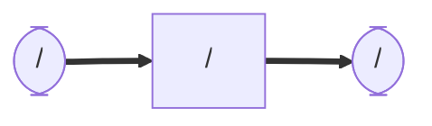

# lucia_slam_toolbox
### Node and Topic

## Dependency
    sudo apt install ros-humble-slam-toolbox
## Setup
    cd ~/ros2_ws/src  #Go to ros workspace

    git clone https://github.com/iHaruruki/lucia_slam_toolbox.git #clone this package

    cd ~/ros2_ws

    colcon build --symlink-install

    source install/setup.bash

## Usage

## License
## Authors
## References
