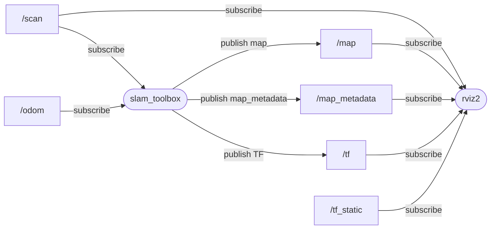

```mermaid
flowchart LR
    T_SCAN["/scan"] -- subscribe --> SLAM(["slam_toolbox"]) & RVIZ(["rviz2"])
    T_ODOM["/odom"] -- subscribe --> SLAM
    SLAM -- publish map --> T_MAP["/map"]
    SLAM -- publish map_metadata --> T_MAP_METADATA["/map_metadata"]
    SLAM -- publish TF --> T_TF["/tf"]
    T_MAP -- subscribe --> RVIZ
    T_MAP_METADATA -- subscribe --> RVIZ
    T_TF -- subscribe --> RVIZ
    T_TF_STATIC["/tf_static"] -- subscribe --> RVIZ
```
